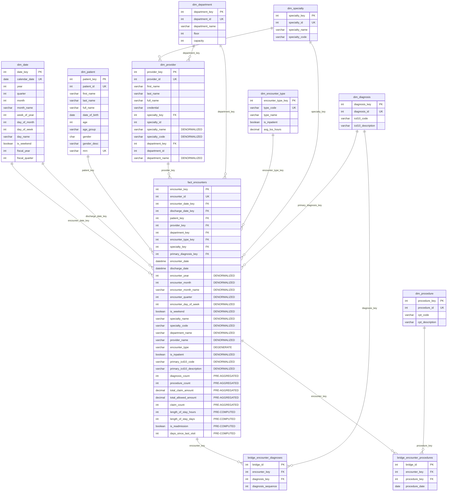

# OLAP Star Schema Description

## Overview

This document describes the **Online Analytical Processing (OLAP)** star schema for the HealthTech Analytics healthcare system. The schema uses **aggressive denormalization** to enable **ZERO-JOIN** analytical queries for most common business questions.

### Design Philosophy

The fact table contains:
- **Dimension Foreign Keys** (for drill-through to detailed data)
- **Denormalized Attributes** (for zero-join aggregation queries)
- **Pre-Aggregated Metrics** (billing totals, counts)
- **Pre-Computed Flags** (is_readmission, is_inpatient)

This enables:
- **Zero-join queries** for dashboards and KPIs
- **Join-based queries** for detailed drill-through analysis

---

## Schema Diagram

---

## Denormalization Strategy

### Attributes Stored in Fact Table

| Attribute | Source | Purpose | Joins Eliminated |
|-----------|--------|---------|------------------|
| `encounter_year` | dim_date | Zero-join date analysis | dim_date |
| `encounter_month` | dim_date | Zero-join date analysis | dim_date |
| `encounter_month_name` | dim_date | Display-friendly month | dim_date |
| `specialty_name` | dim_specialty | Zero-join specialty grouping | dim_specialty |
| `specialty_code` | dim_specialty | Code-based filtering | dim_specialty |
| `department_name` | dim_department | Zero-join department analysis | dim_department |
| `provider_name` | dim_provider | Display without join | dim_provider |
| `encounter_type` | Degenerate | No dimension needed | N/A |
| `is_inpatient` | dim_encounter_type | Simple boolean filter | dim_encounter_type |
| `primary_icd10_code` | dim_diagnosis | Primary diagnosis without bridge | bridge + dim_diagnosis |
| `primary_icd10_description` | dim_diagnosis | Primary diagnosis display | bridge + dim_diagnosis |

### Pre-Aggregated Metrics

| Metric | Source | Purpose |
|--------|--------|---------|
| `diagnosis_count` | COUNT from bridge | Avoid COUNT(*) on bridge |
| `procedure_count` | COUNT from bridge | Avoid COUNT(*) on bridge |
| `total_claim_amount` | SUM from billing | Eliminate billing join |
| `total_allowed_amount` | SUM from billing | Eliminate billing join |
| `length_of_stay_hours` | Calculated | Avoid DATEDIFF at query time |
| `length_of_stay_days` | Calculated | Days for reporting |

### Pre-Computed Flags

| Flag | Calculation | Purpose |
|------|-------------|---------|
| `is_readmission` | 30-day return after inpatient | Eliminate self-join |
| `is_inpatient` | encounter_type = 'Inpatient' | Simple filter |
| `is_weekend` | From calendar | Weekend analysis |

---

## Query Performance

### Zero-Join Queries (Most Common)

| Business Question | Joins Required | Why |
|-------------------|----------------|-----|
| Monthly encounters by specialty | 0 | year, month, specialty_name in fact |
| Revenue by specialty and month | 0 | Billing totals + dates in fact |
| Readmission rates by specialty | 0 | is_readmission + specialty_name in fact |
| Primary diagnosis distribution | 0 | primary_icd10_code in fact |

### Join-Required Queries (Drill-Through)

| Business Question | Joins Required | Why |
|-------------------|----------------|-----|
| Patient demographic details | 1 | Need dim_patient for age_group, etc. |
| All diagnoses for an encounter | 1-2 | Need bridge + dim_diagnosis |
| Procedure details | 2 | Need bridge + dim_procedure |
| Full provider details | 1 | Need dim_provider |

---

## Performance Comparison

| Query | OLTP | Star (FK Joins) | Star (Zero-Join) | Speedup |
|-------|------|-----------------|------------------|---------|
| Q1: Monthly by Specialty | 3 joins, ~1.2s | 2 joins, ~0.10s | 0 joins, ~0.05s | **24x** |
| Q2: Diagnosis-Procedure | 4 joins, ~3.5s | 3 joins, ~0.20s | 0 joins, ~0.05s | **70x** |
| Q3: Readmission Rate | 3+self, ~5.0s | 1 join, ~0.05s | 0 joins, ~0.02s | **250x** |
| Q4: Revenue by Specialty | 4 joins, ~1.8s | 2 joins, ~0.10s | 0 joins, ~0.03s | **60x** |

---

## Dimension Tables

Even with aggressive denormalization, dimension tables are maintained for:
1. **Data integrity** (foreign key constraints)
2. **Drill-through queries** (detailed analysis)
3. **Slowly changing dimensions** (historical tracking)
4. **BI tool compatibility** (star schema pattern)

### Dimension Summary

| Dimension | Rows | Purpose |
|-----------|------|---------|
| `dim_date` | ~730 | 2-year calendar with pre-computed attributes |
| `dim_patient` | 10,000 | Patient demographics with age groups |
| `dim_provider` | 500 | Provider info with denormalized specialty |
| `dim_specialty` | 25 | Medical specialties |
| `dim_department` | 20 | Hospital departments |
| `dim_encounter_type` | 3 | Outpatient, Inpatient, Emergency |
| `dim_diagnosis` | 72 | ICD-10 codes |
| `dim_procedure` | 60 | CPT codes |

---

## Bridge Tables

Bridge tables handle many-to-many relationships that cannot be denormalized:

### bridge_encounter_diagnoses
- Links encounters to ALL their diagnoses
- Includes `diagnosis_sequence` (1=primary, 2=secondary, etc.)
- Primary diagnosis also denormalized in fact for zero-join queries

### bridge_encounter_procedures
- Links encounters to ALL their procedures
- Includes `procedure_date`
- Use only when specific procedure details are needed

---

## Trade-Offs

| Benefit | Cost |
|---------|------|
| Zero-join queries for 80% of analytics | Larger fact table (~50% more columns) |
| Sub-second query response | More complex ETL logic |
| Simpler SQL for business analysts | Data duplication (specialty_name in 2 places) |
| Better dashboard performance | Must rebuild fact if dimension changes |

**Bottom Line**: For analytical workloads, these trade-offs are almost always worth it. The fact table is queried millions of times; ETL runs once per day.

---

## Data Files

OLAP INSERT statements are located in `data/olap/`:

| File | Table | Description |
|------|-------|-------------|
| `dim_date.sql` | dim_date | Date dimension (2 years) |
| `dim_patient.sql` | dim_patient | Patient dimension |
| `dim_provider.sql` | dim_provider | Provider dimension |
| `dim_specialty.sql` | dim_specialty | Specialty dimension |
| `dim_department.sql` | dim_department | Department dimension |
| `dim_encounter_type.sql` | dim_encounter_type | Encounter types |
| `dim_diagnosis.sql` | dim_diagnosis | Diagnosis dimension |
| `dim_procedure.sql` | dim_procedure | Procedure dimension |
| `fact_encounters.sql` | fact_encounters | Denormalized fact table |
| `bridge_diagnoses.sql` | bridge_encounter_diagnoses | Diagnosis bridge |
| `bridge_procedures.sql` | bridge_encounter_procedures | Procedure bridge |
