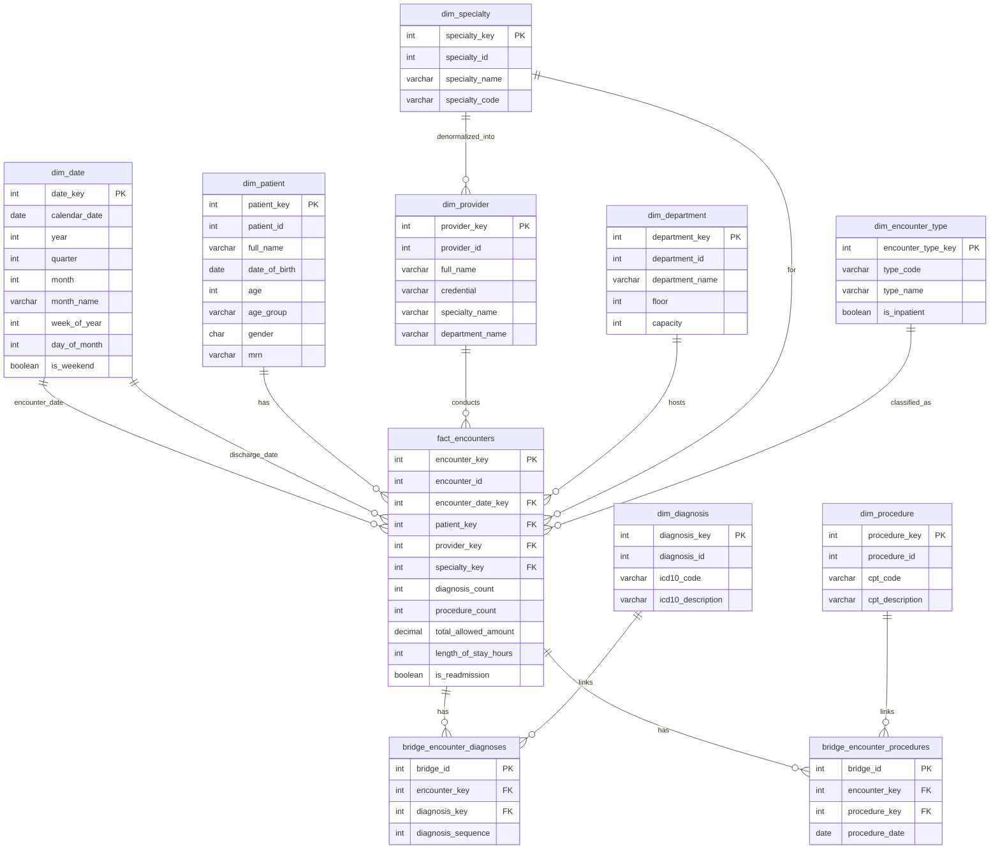

# OLAP Star Schema Description

## Overview

This document describes the **Online Analytical Processing (OLAP)** star schema for the HealthTech Analytics healthcare system. The schema is designed to optimize analytical query performance by:

- **Denormalizing** dimension attributes to reduce JOINs
- **Pre-aggregating** common metrics in the fact table
- **Creating surrogate keys** for efficient joins
- **Using bridge tables** for many-to-many relationships

---

## Schema Diagram

---

## Dimension Tables

### Core Dimensions

| Dimension | Purpose | Key Attributes |
|-----------|---------|----------------|
| `dim_date` | Time analysis | year, month, quarter, is_weekend |
| `dim_patient` | Patient demographics | age_group, gender |
| `dim_provider` | Provider info | credential, specialty_name (denormalized) |
| `dim_specialty` | Medical specialties | specialty_name, specialty_code |
| `dim_department` | Hospital locations | department_name, floor, capacity |
| `dim_encounter_type` | Visit categories | type_name, is_inpatient |

### Reference Dimensions

| Dimension | Purpose | Key Attributes |
|-----------|---------|----------------|
| `dim_diagnosis` | ICD-10 codes | icd10_code, icd10_description |
| `dim_procedure` | CPT codes | cpt_code, cpt_description |

---

## Fact Table: fact_encounters

### Grain
**One row per patient encounter**

### Dimension Keys
- `encounter_date_key` → dim_date
- `discharge_date_key` → dim_date
- `patient_key` → dim_patient
- `provider_key` → dim_provider
- `department_key` → dim_department
- `encounter_type_key` → dim_encounter_type
- `specialty_key` → dim_specialty
- `primary_diagnosis_key` → dim_diagnosis

### Pre-Aggregated Metrics

| Metric | Type | Source |
|--------|------|--------|
| `diagnosis_count` | INT | COUNT from encounter_diagnoses |
| `procedure_count` | INT | COUNT from encounter_procedures |
| `total_claim_amount` | DECIMAL | SUM from billing |
| `total_allowed_amount` | DECIMAL | SUM from billing |
| `length_of_stay_hours` | INT | DATEDIFF(discharge, encounter) |
| `is_readmission` | BOOLEAN | Computed 30-day flag |

---

## Bridge Tables

### bridge_encounter_diagnoses
Links encounters to all their diagnoses (many-to-many).

### bridge_encounter_procedures
Links encounters to all their procedures (many-to-many).

---

## Performance Improvements

### Before (OLTP) vs After (Star Schema)

| Query | OLTP Joins | Star Schema Joins | Improvement |
|-------|------------|-------------------|-------------|
| Q1: Monthly Encounters | 2 | 1 | 50% fewer joins |
| Q2: Diagnosis-Procedure | 3 | 2 | + no row explosion |
| Q3: Readmissions | Self-join | 0 (pre-computed) | ~10x faster |
| Q4: Revenue by Specialty | 3 | 1 | 66% fewer joins |

---

## Data Files

OLAP dimension and fact table INSERT statements are located in `data/olap/`:

| File | Table | Description |
|------|-------|-------------|
| `dim_date.sql` | dim_date | Date dimension (2 years) |
| `dim_patient.sql` | dim_patient | Patient dimension |
| `dim_provider.sql` | dim_provider | Provider dimension |
| `dim_specialty.sql` | dim_specialty | Specialty dimension |
| `dim_department.sql` | dim_department | Department dimension |
| `dim_encounter_type.sql` | dim_encounter_type | Encounter types |
| `dim_diagnosis.sql` | dim_diagnosis | Diagnosis dimension |
| `dim_procedure.sql` | dim_procedure | Procedure dimension |
| `fact_encounters.sql` | fact_encounters | Fact table |
| `bridge_diagnoses.sql` | bridge_encounter_diagnoses | Diagnosis bridge |
| `bridge_procedures.sql` | bridge_encounter_procedures | Procedure bridge |
