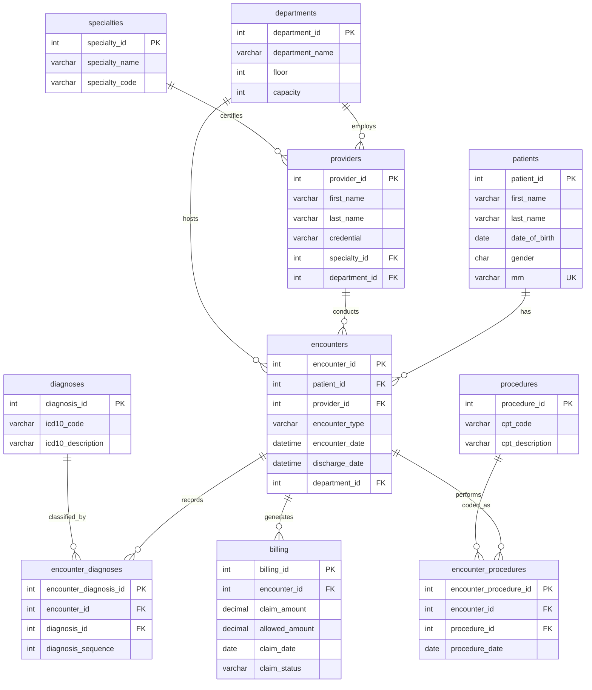

# OLTP Schema Description

## Overview

This document describes the **Online Transaction Processing (OLTP)** database schema for the HealthTech Analytics healthcare system. The schema follows **Third Normal Form (3NF)** normalization principles, which optimize for:

- **Data Integrity**: Minimizing data redundancy reduces the risk of inconsistencies
- **Write Performance**: Normalized tables make INSERT, UPDATE, and DELETE operations efficient
- **Storage Efficiency**: No duplicate data means less storage space required

However, this design creates **performance challenges for analytical queries** that require aggregating data across multiple tables.

---

## Schema Diagram



---

## Table Descriptions

### Core Entity Tables (10,000 rows each)

| Table | Purpose | Key Columns |
|-------|---------|-------------|
| `patients` | Patient demographics | patient_id, first_name, last_name, date_of_birth, gender, mrn |
| `providers` | Healthcare providers | provider_id, first_name, last_name, credential, specialty_id, department_id |
| `specialties` | Medical specialties | specialty_id, specialty_name, specialty_code |
| `departments` | Hospital departments | department_id, department_name, floor, capacity |
| `diagnoses` | ICD-10 codes | diagnosis_id, icd10_code, icd10_description |
| `procedures` | CPT codes | procedure_id, cpt_code, cpt_description |

### Transactional Tables (10,000 rows each)

| Table | Purpose | Key Columns |
|-------|---------|-------------|
| `encounters` | Patient visits | encounter_id, patient_id, provider_id, encounter_type, dates |
| `encounter_diagnoses` | Diagnoses per visit | encounter_diagnosis_id, encounter_id, diagnosis_id, sequence |
| `encounter_procedures` | Procedures per visit | encounter_procedure_id, encounter_id, procedure_id, date |
| `billing` | Claims data | billing_id, encounter_id, amounts, status |

---

## Normalization Benefits

1. **No Data Duplication**: Patient/provider names stored once
2. **Easy Updates**: Change a specialty name in one place
3. **Referential Integrity**: Foreign keys prevent orphaned records

---

## Performance Limitations

### Why Analytical Queries Are Slow

When running analytical queries (e.g., "monthly revenue by specialty"), the normalized schema requires:

1. **Multiple JOINs**: A simple revenue query needs 4+ table joins:
   ```
   billing → encounters → providers → specialties
   ```

2. **Junction Table Overhead**: Many-to-many relationships require joining through bridge tables:
   ```
   encounters → encounter_diagnoses → diagnoses
   encounters → encounter_procedures → procedures
   ```

3. **No Pre-Aggregation**: Counts and sums must be calculated at query time

4. **Row Explosion**: Joining multiple junction tables can multiply row counts exponentially

---

## Data Files

SQL INSERT statements for each table are located in `data/oltp/`:

| File | Table | Rows |
|------|-------|------|
| `patients.sql` | patients | 10,000 |
| `specialties.sql` | specialties | 10,000 |
| `departments.sql` | departments | 10,000 |
| `providers.sql` | providers | 10,000 |
| `diagnoses.sql` | diagnoses | 10,000 |
| `procedures.sql` | procedures | 10,000 |
| `encounters.sql` | encounters | 10,000 |
| `encounter_diagnoses.sql` | encounter_diagnoses | 10,000 |
| `encounter_procedures.sql` | encounter_procedures | 10,000 |
| `billing.sql` | billing | 10,000 |

**Total: 100,000 rows across 10 tables**
