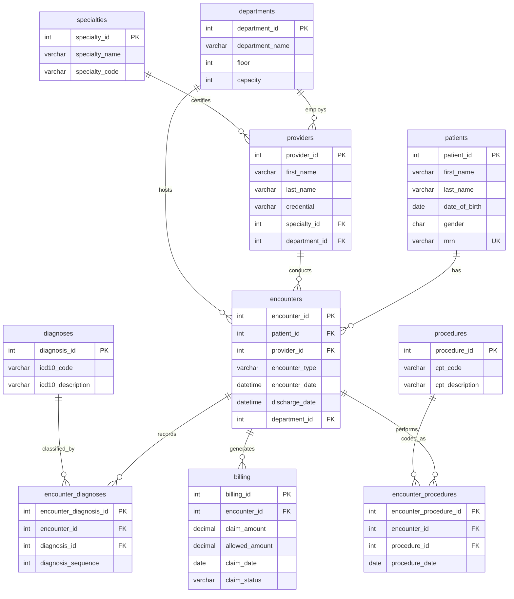

# OLTP Schema Description

## Overview

This document describes the **Online Transaction Processing (OLTP)** database schema for the HealthTech Analytics healthcare system. The schema follows **Third Normal Form (3NF)** normalization principles, which optimize for:

- **Data Integrity**: Minimizing data redundancy reduces the risk of inconsistencies
- **Write Performance**: Normalized tables make INSERT, UPDATE, and DELETE operations efficient
- **Storage Efficiency**: No duplicate data means less storage space required

However, this design creates **performance challenges for analytical queries** that require aggregating data across multiple tables.

---

## Schema Diagram



---

## Table Descriptions

### Lookup/Reference Tables (Fixed Size)

These tables represent **master data** with a small, fixed number of rows. They are referenced by the larger transactional tables via foreign keys.

| Table | Rows | Purpose | Key Columns |
|-------|------|---------|-------------|
| `specialties` | 25 | Medical specialties | specialty_id, specialty_name, specialty_code |
| `departments` | 20 | Hospital departments | department_id, department_name, floor, capacity |
| `diagnoses` | 72 | ICD-10 codes | diagnosis_id, icd10_code, icd10_description |
| `procedures` | 60 | CPT codes | procedure_id, cpt_code, cpt_description |

### Entity Tables (Growing Over Time)

These tables represent core business entities that grow as new data is added.

| Table | Rows | Purpose | Key Columns |
|-------|------|---------|-------------|
| `patients` | 10,000 | Patient demographics | patient_id, first_name, last_name, date_of_birth, gender, mrn |
| `providers` | 500 | Healthcare providers | provider_id, first_name, last_name, credential, specialty_id, department_id |

### Transactional Tables (High Volume)

These tables capture the day-to-day operations of the healthcare system.

| Table | Rows | Purpose | Key Columns |
|-------|------|---------|-------------|
| `encounters` | 10,000 | Patient visits | encounter_id, patient_id, provider_id, encounter_type, dates |
| `encounter_diagnoses` | ~25,000 | Diagnoses per visit (2-3 avg) | encounter_diagnosis_id, encounter_id, diagnosis_id, sequence |
| `encounter_procedures` | ~14,000 | Procedures per visit (1-2 avg) | encounter_procedure_id, encounter_id, procedure_id, date |
| `billing` | 10,000 | Claims data | billing_id, encounter_id, amounts, status |

---

## Data Distribution

The OLTP data follows realistic healthcare patterns:

### Encounter Types
- **Outpatient**: 60% (routine visits, follow-ups)
- **Inpatient**: 25% (hospital admissions)
- **Emergency**: 15% (ER visits)

### Diagnoses per Encounter
- 1 diagnosis: 15%
- 2 diagnoses: 40%
- 3 diagnoses: 30%
- 4+ diagnoses: 15%

### Billing Amounts
- Outpatient: $100 - $2,000
- Emergency: $500 - $10,000
- Inpatient: $5,000 - $100,000

---

## Normalization Benefits

1. **No Data Duplication**: Patient/provider names stored once
2. **Easy Updates**: Change a specialty name in one place
3. **Referential Integrity**: Foreign keys prevent orphaned records
4. **Storage Efficiency**: Lookup tables are small; only IDs are stored in transactional tables

---

## Data Files

SQL INSERT statements for each table are located in `data/oltp/`:

| File | Table | Rows | Type |
|------|-------|------|------|
| `specialties.sql` | specialties | 25 | Lookup |
| `departments.sql` | departments | 20 | Lookup |
| `diagnoses.sql` | diagnoses | 72 | Reference |
| `procedures.sql` | procedures | 60 | Reference |
| `patients.sql` | patients | 10,000 | Entity |
| `providers.sql` | providers | 500 | Entity |
| `encounters.sql` | encounters | 10,000 | Transaction |
| `encounter_diagnoses.sql` | encounter_diagnoses | ~25,000 | Junction |
| `encounter_procedures.sql` | encounter_procedures | ~14,000 | Junction |
| `billing.sql` | billing | 10,000 | Transaction |

**Total: ~70,000 rows across 10 tables**

---

## Data Generation

The data is generated using `scripts/generate_realistic_data.py` which creates:

- **Realistic ICD-10 codes** across 10 medical categories
- **Realistic CPT codes** for E&M visits, surgeries, radiology, lab tests
- **Weighted distributions** for encounter types and claim statuses
- **Proper referential integrity** with all foreign keys valid

To regenerate the data:
```bash
python scripts/generate_realistic_data.py
```
